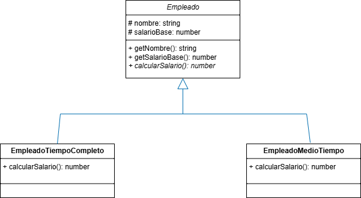
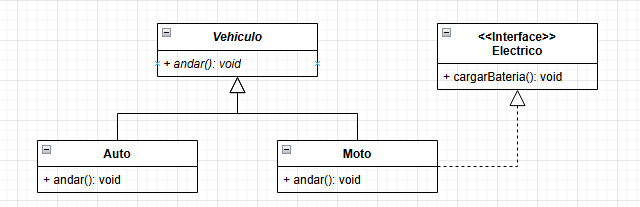

## Grupo 11
- Jeronimo Baltian Ortiz 
- Jimena Martinez Arana 
- Carlos Alberto Arce 
- Marcos Diaz
---
## Ejecucion de los programas de cada ejercicio:

` npm start ejer/src/index.ts `

Despues de ==ejer== hay que poner el numero del ejercicio
Ej:

` npm start ejer1/src/index.ts `

---

## EJERCICIO 3 - Diagrama UML

---

## EJERCICIO 5 - Diagrama UML
